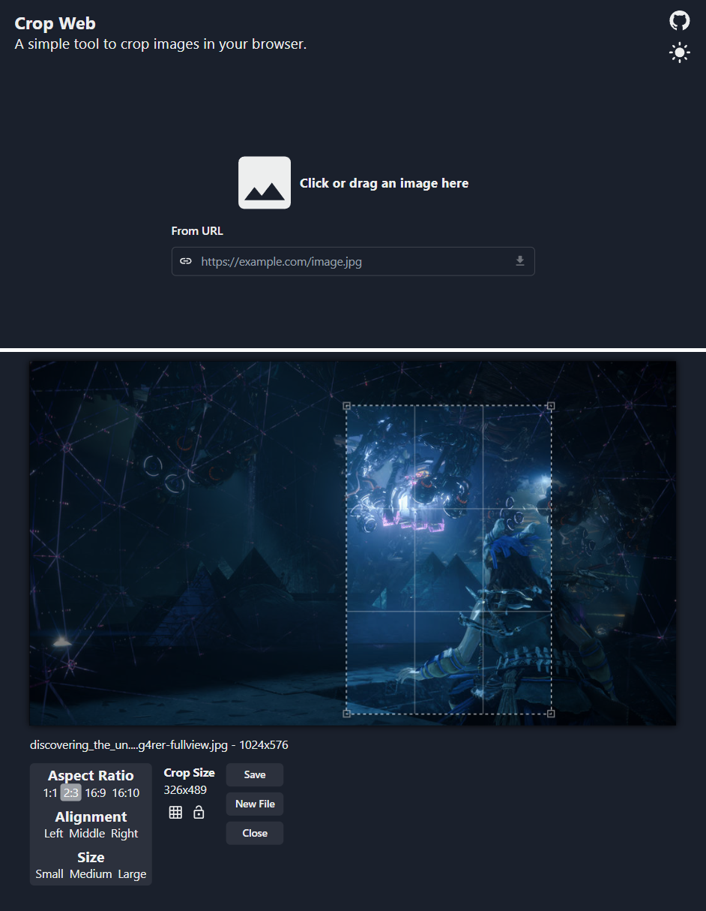

## Crop Web

Crop Web is a web app for cropping images in a web browser, built with React.  
I made this to quickly try out a few libraries I haven't used before.

Demo: https://cropweb.vercel.app

### Self Hosting
[Download](https://github.com/ac3ninja/cropweb/releases/latest/download/package.zip) the latest release and serve the files with a web server of your choosing.

### Preview

